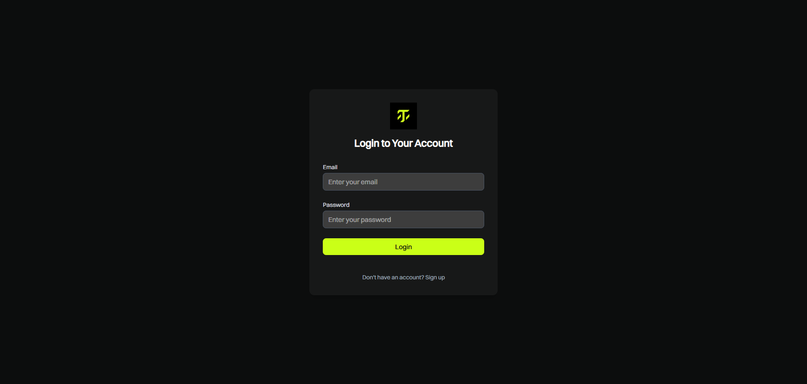
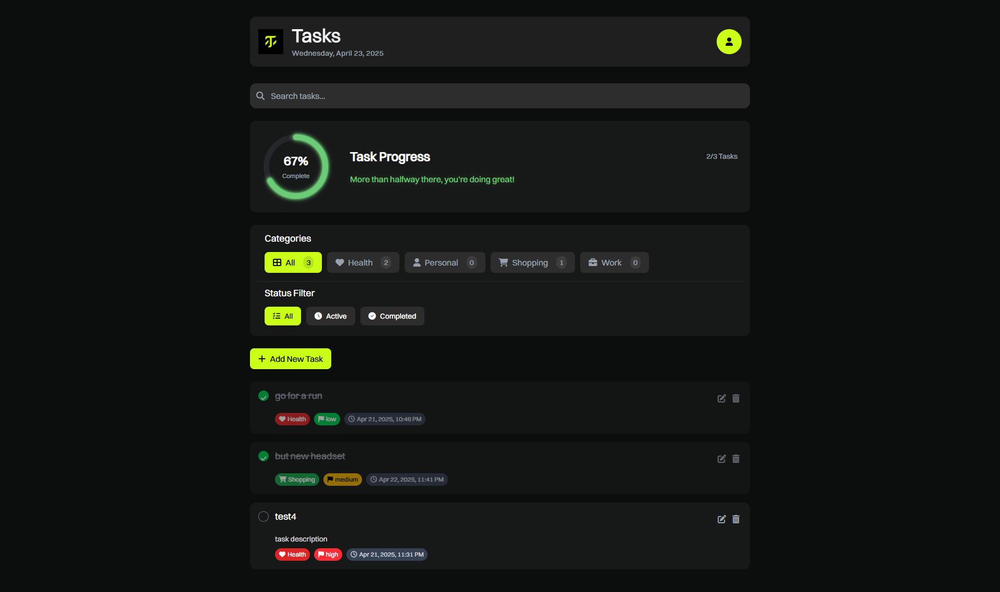
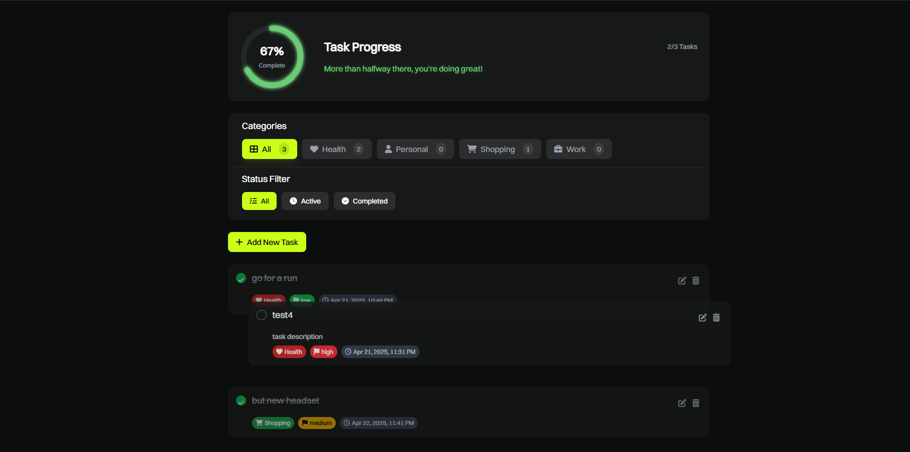

# Task Management Application

## Overview
A modern, responsive task management application built with React and Node.js, featuring drag-and-drop task prioritization, category management, and user authentication powered by Supabase.

## Screenshots

### Login Screen


### Dashboard


### Task Management


### Drag and Drop Functionality


## Technologies Used
- **Frontend**: React 19, Tailwind CSS, Vite, @hello-pangea/dnd
- **Backend**: Node.js, Express
- **Database**: Supabase (PostgreSQL)
- **Authentication**: Supabase Auth
- **State Management**: React Hooks
- **Styling**: Tailwind CSS

## Features
- ✅ Task Management (CRUD operations)
- 🎨 Category Organization with custom colors and icons
- ⚡ Real-time Updates
- 🔄 Drag-and-drop Task Prioritization
- 🔐 Secure User Authentication
- 📱 Responsive Design
- 🔍 Task Filtering and Search
- 🎯 Priority Levels (Low, Medium, High)

## Prerequisites
- Node.js (v18 or higher)
- npm or yarn
- Supabase account
- Git

## Setup Instructions

### Environment Variables

Backend Environment Setup (backend/.env):
```env
SUPABASE_URL=your_supabase_url
SUPABASE_KEY=your_supabase_key
PORT=3000
```

### Installation

1. Clone the repository
```bash
git clone https://github.com/roxxe3/task-management-app
cd task-management-app
```

2. Frontend Setup
```bash
cd task-app-frontend
npm install
npm run dev
```

3. Backend Setup
```bash
cd backend
npm install
npm run dev
```

4. Database Setup
- Create a new Supabase project at https://supabase.com
- Get your project credentials from Settings > API
- Set the credentials in your .env file
- Open the SQL Editor in your Supabase dashboard
- Run the SQL from backend/database-setup.sql

## Project Structure

```
task-management-app/
├── backend/                 # Backend Node.js application
│   ├── controllers/        # Request handlers
│   ├── middleware/         # Custom middleware
│   ├── routes/            # API routes
│   ├── validations/       # Input validation
│   ├── models/            # Data models
│   └── config/            # Configuration files
│
├── task-app-frontend/      # Frontend React application
│   ├── src/
│   │   ├── components/    # React components
│   │   ├── hooks/        # Custom hooks
│   │   ├── pages/        # Page components
│   │   ├── services/     # API services
│   │   └── utils/        # Utility functions
│   └── public/           # Static assets
```

## API Documentation
See [API_DOCUMENTATION.md](./API_DOCUMENTATION.md) for detailed API endpoints and usage.

## Architecture Decisions
See [ARCHITECTURE.md](./ARCHITECTURE.md) for detailed implementation decisions and technical architecture.

## AI Tools Usage
See [AI_USAGE.md](./AI_USAGE.md) for documentation on AI tools used in development.

## Contributing
1. Fork the repository
2. Create your feature branch (`git checkout -b feature/AmazingFeature`)
3. Commit your changes (`git commit -m 'Add some AmazingFeature'`)
4. Push to the branch (`git push origin feature/AmazingFeature`)
5. Open a Pull Request

## License
This project is licensed under the MIT License - see the [LICENSE](LICENSE) file for details.